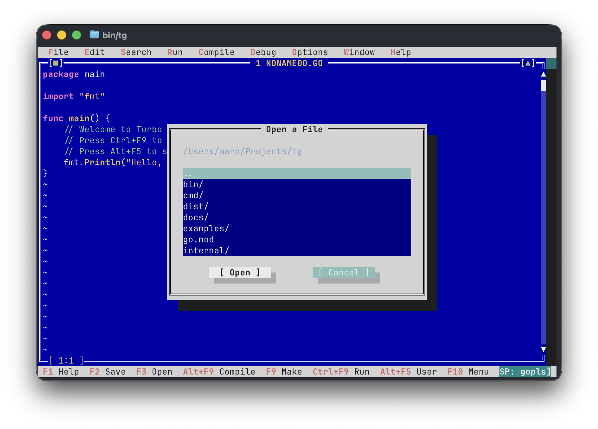

[한국어](./README.ko.md) | [English](./README.md)

# Turbo Go (Version 0.90)


> **Retro Borland Turbo Pascal / Turbo C Look & Feel IDE for the Go Language**

**Turbo Go** is a retro terminal development environment (TUI IDE) that brings together the classic 90s visual interface of Borland's legendary **Turbo Pascal** and **Turbo C** (Turbo Vision blue editor canvas, double-line frames `╔═╗`, top pull-down menu bar, bottom hotkey bar, and the `Alt+F5` User Screen) with the modern **Go compiler and Delve debugger**.

---

<p align="center">
  
</p>

---

## Key Features

* **Classic Borland Turbo Vision UI**:
  * Signature Turbo Blue editor canvas (`#0000A8`) with double-line box-drawing characters (`╔═╗`, `║ ║`, `╚═╝`)
  * Text drop shadows and retro window headers (`[■] 1 NONAME00.GO [▲]`)
  * Top pull-down menu bar (`File`, `Edit`, `Search`, `Run`, `Compile`, `Debug`, `Window`, `Help`)
  * Bottom hotkey bar (`F1 Help`, `F2 Save`, `F3 Open`, `Alt+F9 Compile`, `F9 Make`, `Ctrl+F9 Run`, `Alt+F5 User`, `F10 Menu`)

* **Go Syntax Highlighting**:
  * Syntax highlighting for Go keywords, types, literals (strings, numbers, runes), built-in functions, and comments

* **Compiling Modal Dialog & Multi-File Project Support**:
  * Authentic Borland-style "Compiling..." modal dialog displaying target file, total lines, error/warning count, and elapsed build time
  * **Multi-File & Go Module Support**: Automatically detects `go.mod` modules or aggregates all package `.go` files in the directory so multi-file projects compile seamlessly
  * Displays file name, line number, and error messages on build failures, with **instant jump to error line (even across different files)** in the editor

* **Alt+F5 User Screen**:
  * The hallmark Turbo C feature: switch to a full-screen DOS console view to inspect execution output, and return to the IDE with any keypress

* **Interactive Delve Debugger Integration**:
  * Toggle breakpoints (`●`) with `F4` ➔ highlighted across the entire line with a **solid red bar**
  * `F5` Start Debugging / Continue, `F8` Step Over, `F7` Trace Into
  * Active execution line highlighted with a **solid yellow bar**
  * Real-time variable inspection (name, type, value) via the bottom **Watches Window** (Debug menu)

* **Borland Retro Sound Effects (Sound FX)**:
  * Crisp dual-tone beep on successful compilation; deep error buzz on build failure
  * Satisfying ping audio feedback on breakpoint hits and stepping
  * Sound toggle via `F10` ➔ `Options` ➔ `Sound: ON / OFF`

---

## Keyboard Shortcuts

| Shortcut | Function | Description |
| --- | --- | --- |
| **Alt + F** | **File Menu** | Open File menu directly |
| **Alt + E** | **Edit Menu** | Open Edit menu directly |
| **Alt + S** | **Search Menu** | Open Search menu directly |
| **Alt + R** | **Run Menu** | Open Run menu directly |
| **Alt + C** | **Compile Menu** | Open Compile menu directly |
| **Alt + D** | **Debug Menu** | Open Debug menu directly |
| **Alt + O** | **Options Menu** | Open Options menu directly |
| **Alt + W** | **Window Menu** | Open Window menu directly |
| **Alt + H** | **Help Menu** | Open Help menu directly |
| **F1** | Help / About | Open Turbo Go info and help dialog |
| **F2** | Save | Save current buffer / Save As |
| **F3** | Open | Open file browser dialog |
| **F4** | **Breakpoint** | Set/unset breakpoint (`●`) on the current line |
| **F5** | **Debug / Continue** | Start debugging / Continue to next breakpoint |
| **F7** | **Trace Into** | Step into function |
| **F8** | **Step Over** | Step over function |
| **Ctrl + F2** | **Reset Debugger** | Terminate debug session and reset instruction pointer |
| **Ctrl + F** | **Find** | Open find/search dialog |
| **Ctrl + L** | **Search Again** | Find next occurrence |
| **Alt + G** | **Go to Line** | Jump cursor to specific line number (`Ctrl+G`) |
| **Alt + L** | **Line Numbers** | Toggle line number gutter on/off (`Option+L`, `F6`) |
| **Ctrl + F9** | **Run** | Build, execute, and display output in the **User Screen** |
| **Alt + F9** | **Compile** | Build with the "Compiling..." statistics modal |
| **F9** | Make | Execute build |
| **Alt + F5** | **User Screen** | Toggle program execution output screen |
| **F10** | Menu Bar | Focus top pull-down menu bar |
| **Alt + X** | Exit | Quit Turbo Go |
| **Ctrl + Left / Right** | **Word Jump** | Move cursor word-by-word (macOS: **Option + Left / Right**) |
| **Shift + Arrow Keys** | **Select Block** | Select/highlight text block (supports Ctrl/Option for word selection) |
| **Ctrl + A** | **Select All** | Select all buffer text (`Edit ➔ Select All`) |
| **Ctrl + C** / **Ctrl + Ins** | **Copy** | Copy selected block to clipboard (`Edit ➔ Copy`) |
| **Ctrl + X** / **Shift + Del** | **Cut** | Cut selected block to clipboard (`Edit ➔ Cut`) |
| **Ctrl + V** / **Shift + Ins** | **Paste** | Paste clipboard contents at cursor (`Edit ➔ Paste`) |
| **Esc** | Close | Close active modal/dialog or clear selection |

> [!TIP]
> **macOS Terminal Option (Alt) Key Configuration**:
> On macOS, to ensure `Alt` key shortcuts (`Alt+F`, `Alt+X`, `Alt+F9`, `Alt+F5`, etc.) function properly, configure your terminal to **use the Option key as a Meta key**:
> - **macOS Terminal.app**: `Settings` ➔ `Profiles` ➔ `Keyboard` ➔ Check **"Use Option as Meta key"**
> - **iTerm2**: `Settings` ➔ `Profiles` ➔ `Keys` ➔ Set `Left/Right Option Key` to **"Esc+"**

---

## Installation & Build

### 1. Pre-built Binaries (GitHub Releases)

Download ready-to-use standalone executables for your platform from [GitHub Releases](https://github.com/MaroShim/TurboGo/releases):
* **macOS**: `tg-v0.90-darwin-arm64.tar.gz` (Apple Silicon M-series)
* **Linux**: `tg-v0.90-linux-amd64.tar.gz` (64-bit)
* **Windows**: `tg-v0.90-windows-amd64.zip` (64-bit)

> [!NOTE]
> **Windows Defender / SmartScreen Notice**:
> Since these open-source binaries are newly compiled without expensive commercial code-signing certificates, Windows Defender or SmartScreen may occasionally flag them as unrecognized or a false positive.
> If a Windows SmartScreen popup appears, click **"More info" ➔ "Run anyway"** (추가 정보 ➔ 실행) or add an exclusion to run safely. You can also build directly from source using the Go compiler below.

### 2. Install directly via Go (Recommended)

```bash
go install github.com/MaroShim/tg/cmd/tg@latest
```

Ensure `$GOPATH/bin` (or `~/go/bin`) is in your `$PATH`. You can then launch `tg` from anywhere:

```bash
tg
```

### 3. Build from Source

```bash
git clone https://github.com/MaroShim/TurboGo.git
cd TurboGo
go build -o bin/tg ./cmd/tg
./bin/tg
```
